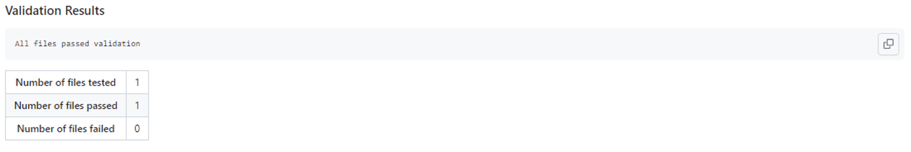
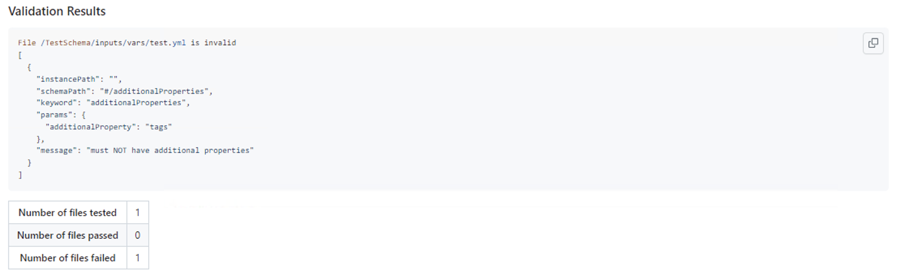

# Validate JSON(s) GitHub Action

Validate JSON(s) by given schema using Ajv schema validator.

## Why another JSON validation action you ask..

I was facing issues with the other actions for JSON validations and so I made my own. If you are facing issues like the one below, I recommend to switch to this one.

```
no schema with key or ref "https://json-schema.org/draft-07/schema"
```

## Inputs

### `schema`

**Required** Relative path to the JSON schema file

### `additional_schema`

**Required if schema use $ref to target other schemas.** Path to additional JSON schema files which is referenced by the schema used for validation. You can target one file or a directory with multiple files. (eg. schemas/ or schemas.schema.json).

### `additional_schema_extention`

**Required for additional_schema which are not .schema.json files.** The file extention of the schema used. ( default: .schema.json )

### `pattern`

**Required** Glob pattern to the JSON(s) to validate

### `allow_matching_properties`

**Optional** When true, allow overlap between "properties" and "patternProperties". Does not affect other strict mode restrictions. (Defaults: "false")

### `use_ajv_formats`

**Optional** When true, allows you to use ajv-format plugin. Please follow the link to see what formats are allowed: https://ajv.js.org/packages/ajv-formats.html (Defaults: "false")

### `show_result_in_summary`
**Optional** When true, allow the results and error (if any) appear in the summary as a code block. (Defaults: "false")

## Outputs

List of all processed files and it's validation result.

## Example usage

### Simple Validation
Above is able to validate JSON and YAML files using a JSON schema. All you need to do to validate is to provide the path of where to find the Scheme using the `schema` key and the file pattern to validate under the `pattern` key. 
```yml
uses: vanekj/validate-json-action@v1
with:
  schema: schemas/default.schema.json
  pattern: data/**/*.json
```

### Validation with definition schemas
Above is able to validate JSON and YAML files using multiple JSON schema. To validate with multiple schemas, provide the path of where to find the Scheme using the `schema` key, add in the definition schemas using the `additional_schemas` key word, (if not using `schema.json` extention) the `additional_schema_extention` key and the file pattern to validate under the `pattern` key.
```yml
uses: vanekj/validate-json-action@v1
with:
  schema: schemas/default.schema.yaml
  additional_schemas: schemas/
  additional_schema_extention: schema.yaml
  pattern: data/**/*.json
```

### Validate against schemas that use string formats: `use_ajv_formats`
 If you are using formats in your schema (https://json-schema.org/understanding-json-schema/reference/string.html#format) set `use_ajv_formats` true and the plugin will be used. Example below:

 ```yaml
 uses: vanekj/validate-json-action@v1
 with:
   schema: schemas/default.schema.json
   pattern: data/**/*.json
   use_ajv_formats: "true"
 ```

### Validate against schemas with overlapping "properties" and "patternProperties": `allow_matching_properties`
 If you see an error about a schema containing overlap between "properties" and "patternProperties", you can enable `allowmatchingProperties` behaviour with the `allow_matching_propertes` option 
Example below:
 ```yaml
 uses: vanekj/validate-json-action@v1
 with:
   schema: schemas/default.schema.json
   pattern: data/**/*.json
   allow_matching_properties: "true"
 ```

### Show Validation results in github actions summary
You have an option to display the results of the validator in a github summary. When making `show_result_in_summary` true, the results found in workflow logs will display within a codeblock in your github summary. Example below:
#### Step in workflow
```yaml
uses: vanekj/validate-json-action@v1
with:
  schema: schemas/default.schema.json
  pattern: data/**/*.json
  show_result_in_summary: "true"
``` 
#### Result in Summary
##### Pass Validation


##### Falied Validation
